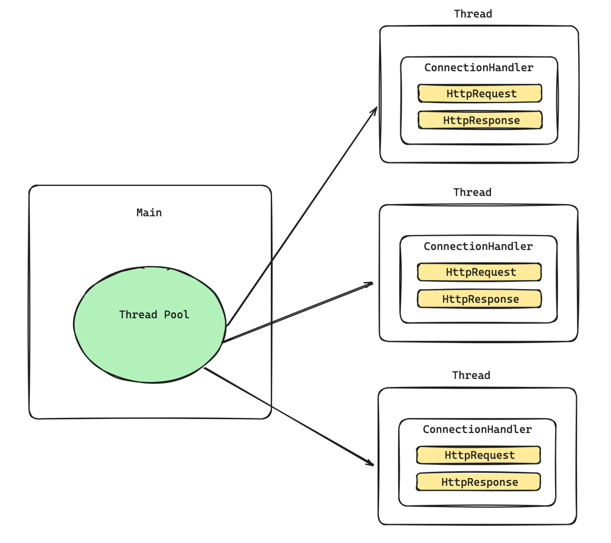
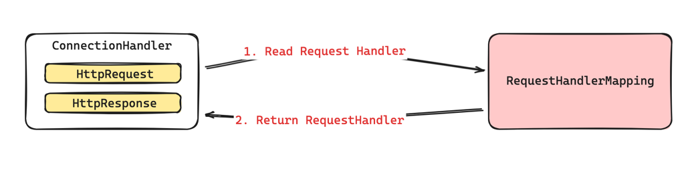
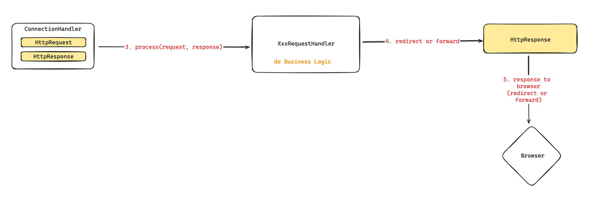
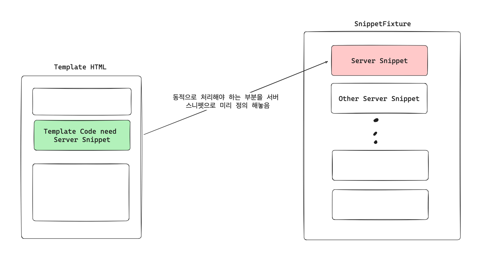
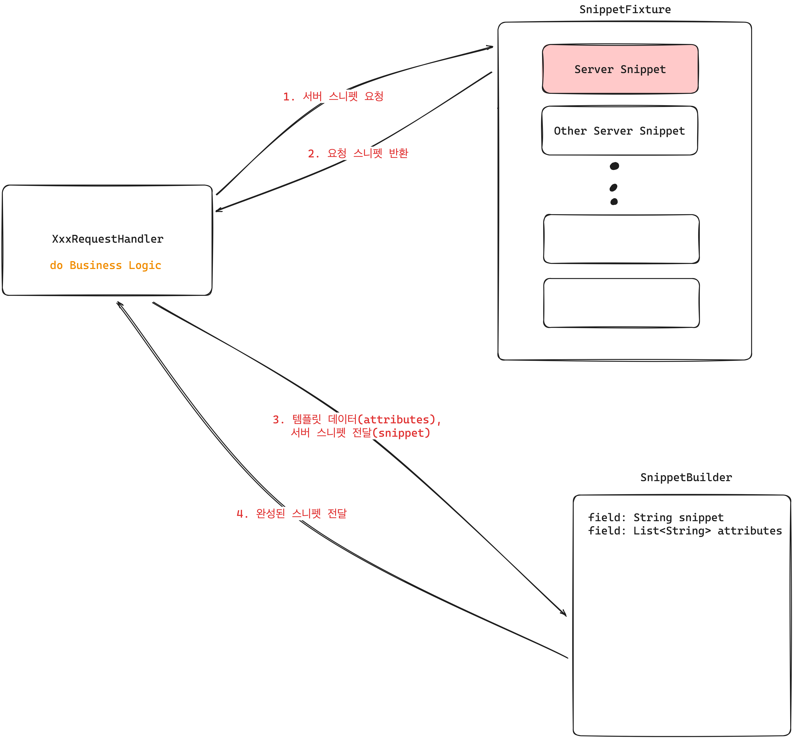
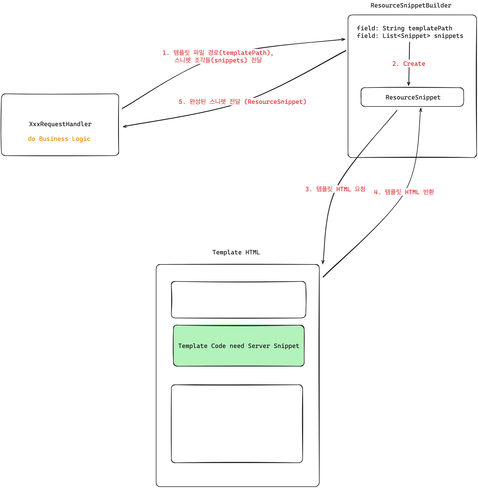
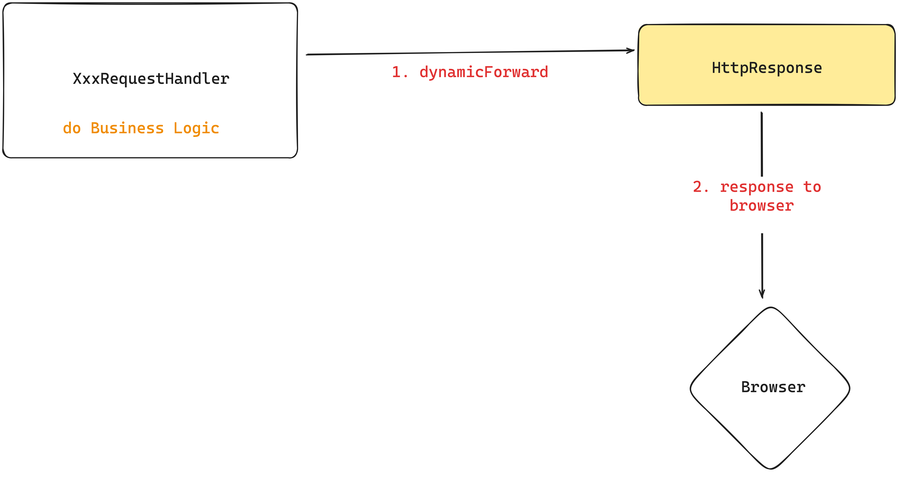

# Java WAS

2024 우아한 테크캠프 프로젝트 WAS

- Java
    - Temurin 17.0.11
    - Gradle 8.5
- 실행방법
    - codesquad.Main.main() 실행

  

## HiiWee's WAS Flow

### 1. 사용자 요청 Multi Thread 분기 처리 및 응답 흐름

- `ThreadPoolExecutor`를 통해 쓰레드 풀을 만들고 각 요청에 대해 스레드 풀의 스레드로 연결합니다.
- 이후 각 요청마다 `HttpRequest`, `HttpResponse` 객체가 만들어지고 요청을 독립적으로 처리할 수 있도록 합니다.

 

### 2. `ConnectionHandler`가 요청에 따른 `RequestHandler`를 찾는다.

- `ConnectionHandler`는 현재 `HttpRequest`를 처리할 수 있는 핸들러를 `요청 경로`를 통해 `RequestHandler`를 찾습니다.

 

### 3. `RequestHandler`의 요청 처리

- `RequestHandler`에게 HttpRequest, HttpResponse를 넘겨주면서 처리를 요청합니다.
- `RequestHandler`는 비즈니스 로직을 처리합니다.
- `RequestHandler`는 HttpResponse에게 redirect 혹은 forward 처리를 요청합니다.
- `HttpResponse`는 브라우저에게 응답을 반환하여 하나의 사용자 요청이 마무리 됩니다.

  

### 2. 동적인 HTML 생성 과정

- 템플릿 HTML에서 동적으로 교체되어야 하는 HTML 코드는, 서버의 SnippetFixture의 상수 필드로 매핑되어 있습니다.

 

- 완성시킬 서버 스니펫을 가져옵니다.
- `SnippetBuilder`에게 스니펫에 넣을 데이터와, 서버 스니펫을 전달하여 스니펫을 생성합니다.

 

- 완성된 서버 스니펫을 템플릿 HTML에서 스니펫이 필요한 영역에 치환하는 과정입니다.
- `ResourceSnippetBuilder`는 외부 템플릿 HTML과 서버에서 생성한 Snippet들을 결합시켜줍니다.

 

- 완성된 `ResourceSnippet`을 직접 `byte[]`로 변환하여 HttpResponse에 직접 응답을 써줍니다. (`dynamicForward`)
- HttpResponse가 브라우저에게 응답을 내리면 동적 HTML 생성 및 반환 작업이 종료됩니다.
